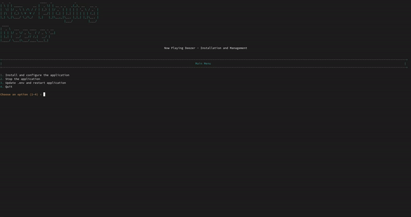

# Now Playing Deezer

## Table of Contents
- [Introduction](#introduction)
- [Features](#features)
- [Prerequisites](#prerequisites)
- [Installation](#installation)
- [Configuration](#configuration)
- [Usage](#usage)
- [OBS Integration](#obs-integration)
- [Troubleshooting](#troubleshooting)
- [Contributing](#contributing)
- [License](#license)

## Introduction

Now Playing Deezer is an application that displays the currently playing song from Deezer on your stream overlay. It uses playerctl to fetch song information and the Spotify API to retrieve album artwork.


## Features

- Real-time display of currently playing song on Deezer
- Fetches album artwork using Spotify API
- Smooth scrolling for long song titles and artist names
- Easy integration with OBS Studio
- Customizable appearance

## Prerequisites

Before you begin, ensure you have met the following requirements:

- Linux-based operating system (Debian, Ubuntu, Fedora, Arch, etc.)
- Node.js and npm installed
- Deezer desktop application
- Spotify Developer account for API access

## Installation

1. Clone the repository:
   ```
   git clone https://github.com/roseratugo/nowPlayingDeezer.git
   cd nowPlayingDeezer
   ```

2. Run the installation script:
   ```
   chmod +x install_nowPlayingDeezer.sh
   ./install_nowPlayingDeezer.sh
   ```

3. Follow the on-screen prompts to install dependencies and configure the application.



## Configuration

1. Launch the configuration script:
   ```
   ./install_nowPlayingDeezer.sh
   ```

2. Choose option 1 to install and configure the application.

3. The script will guide you through:
   - Installing playerctl (if not already installed)
   - Selecting the Deezer player instance
   - Entering your Spotify API credentials

4. After configuration, the script will create a `.env` file with your settings.

## Usage

1. Ensure Deezer is running and playing music.

2. Start the Now Playing Deezer application, use the script and choose option 1 (for installing, if is already installed just skip this step):
   ```
   ./install_nowPlayingDeezer.sh
   ```

3. The application will run on `http://localhost:3000/now-playing` (or the port you specified).

4. To stop the application, use the script and choose option 2:
   ```
   ./install_nowPlayingDeezer.sh
   ```


## OBS Integration

1. In OBS Studio, add a new Browser Source.

2. Set the URL to `http://localhost:3000/now-playing`.

3. Set the width to 400 and height to 120.

4. Check "Shutdown source when not visible" for a transparent background.


## Troubleshooting

- **Issue**: Playerctl not detecting Deezer
  **Solution**: Ensure Deezer is running before starting the application.

- **Issue**: Album artwork not showing
  **Solution**: Check your Spotify API credentials in the `.env` file.

- **Issue**: Application not starting
  **Solution**: Check the `app.log` file for error messages.

## Contributing

Contributions to Now Playing Deezer are welcome. Please follow these steps:

1. Fork the repository.
2. Create a new branch: `git checkout -b feature-branch-name`.
3. Make your changes and commit them: `git commit -m 'Add some feature'`.
4. Push to the original branch: `git push origin feature-branch-name`.
5. Create the pull request.

Alternatively, see the GitHub documentation on [creating a pull request](https://help.github.com/articles/creating-a-pull-request/).

## License

This project is licensed under the [MIT License](LICENSE).
